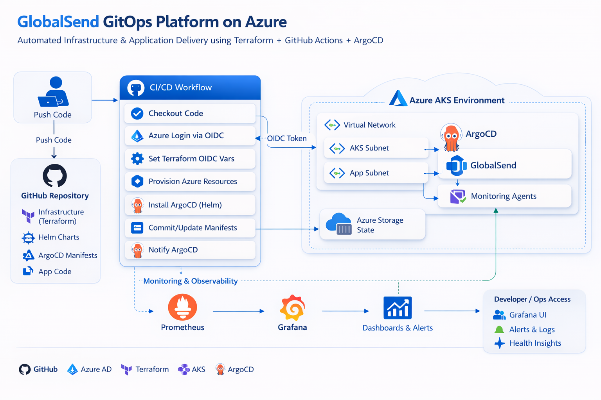
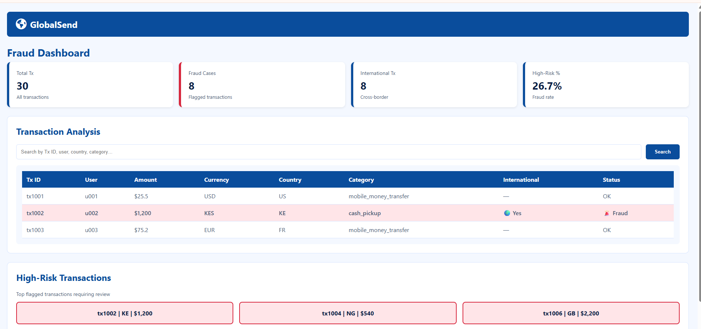

# GlobalSend GitOps Platform

Production-grade GitOps platform on **Azure Kubernetes Service (AKS)** using **Terraform, GitHub Actions, and ArgoCD**.  
This project demonstrates modern DevOps practices: Infrastructure as Code, CI/CD automation, and GitOps-driven deployment.

[](https://github.com/tecknosap/globalsend-gitops-azure/actions/workflows/dev-pipeline.yml)


---

## Overview

GlobalSend is a cloud-native platform that automates infrastructure provisioning, Kubernetes configuration, and application deployment through a **single Git push**.  

Key highlights:

- Fully automated **AKS infrastructure provisioning**
- Secure **OIDC authentication from GitHub to Azure**
- **GitOps-driven Kubernetes deployments** using ArgoCD
- **Self-healing infrastructure and application state**
- Integrated **Prometheus and Grafana monitoring**
- Environment management using **Terragrunt**

---


### Architecture Diagram
    


---

---
### Fraud Dashboard

     

---

---

**Components:**

| Component                | Purpose                            |
| ------------------------ | ---------------------------------- |
| GitHub Actions           | CI/CD automation pipeline          |
| OIDC Federation          | Secure authentication to Azure     |
| Terraform                | Infrastructure provisioning        |
| Terragrunt               | Environment-specific configuration |
| Azure Kubernetes Service | Managed Kubernetes cluster         |
| ArgoCD                   | GitOps controller for deployments  |
| Helm                     | Kubernetes package management      |
| Prometheus               | Metrics collection                 |
| Grafana                  | Observability dashboards           |

---

## Technology Stack

| Category               | Technologies                        |
| ---------------------- | ----------------------------------- |
| Cloud Platform         | Microsoft Azure                     |
| Container Platform     | Kubernetes (AKS)                    |
| Infrastructure as Code | Terraform, Terragrunt               |
| CI/CD                  | GitHub Actions                      |
| GitOps                 | ArgoCD                              |
| Packaging              | Helm                                |
| Monitoring             | Prometheus, Grafana                 |
| Security               | OIDC, RBAC, Calico Network Policies |
| Containers             | Docker                              |

---

## Repository Structure

```text
.
├── .github/workflows/
│   └── dev-pipeline.yml
├── terraform/
│   └── cluster/
│       ├── main.tf
│       ├── network.tf
│       └── variables.tf
├── terragrunt/
│   └── environments/
│       └── dev/
│           └── cluster/
│               └── terragrunt.hcl
├── argocd/
│   └── application.yaml
└── helm/
    └── globalsend/
```

---

## CI/CD Pipeline

**Workflow:**

1. Developer pushes code to the `dev` branch
2. GitHub Actions triggers pipeline
3. OIDC authentication to Azure
4. Terraform provisions infrastructure
5. AKS cluster is deployed or updated
6. ArgoCD installed via Helm
7. ArgoCD syncs repository manifests
8. Application deployed automatically

---

## Deployment Workflow

**Infrastructure Provisioning:** Terraform provisions resource groups, VNet/subnets, AKS cluster, and storage backend.

**GitOps Controller Setup:** ArgoCD installed via Helm with auto-sync and self-healing enabled.

**Application Deployment:** ArgoCD monitors Git and reconciles cluster state automatically.

**Monitoring:** Prometheus collects metrics; Grafana visualizes dashboards accessible via port-forwarding.

---

## Security

* **Authentication:** OIDC from GitHub to Azure (no static credentials)
* **Kubernetes Security:** RBAC and Calico network policies
* **Cloud Security:** Managed identities and environment isolation

---

## Platform Validation

```bash
# Check cluster nodes
kubectl get nodes

# Check running workloads
kubectl get pods -A

# Check ArgoCD applications
kubectl get applications -n argocd

# Check monitoring stack
kubectl get pods -n monitoring

# Check application service
kubectl get svc -n globalsend-site
```

---

## Prerequisites

* Azure subscription
* Azure CLI
* Terraform ≥ 1.5
* kubectl
* Helm
* GitHub repository with Actions enabled

---

## Getting Started

```bash
git clone https://github.com/tecknosap/globalsend-gitops-azure.git
cd globalsend-gitops-azure

cd terraform/cluster
terraform init
terraform plan

git checkout dev
git push origin dev
```

---

## Future Enhancements

* Multi-environment promotion pipeline (dev → staging → prod)
* Azure Key Vault integration
* Kubernetes Ingress controller with TLS
* Horizontal Pod Autoscaling
* External DNS integration

---

## About the Author

Cloud and DevOps Engineer focused on **Azure infrastructure, Kubernetes, and GitOps automation**.

GitHub: [https://github.com/tecknosap](https://github.com/tecknosap)

---

## License

MIT License © 2026 GlobalSend

```

